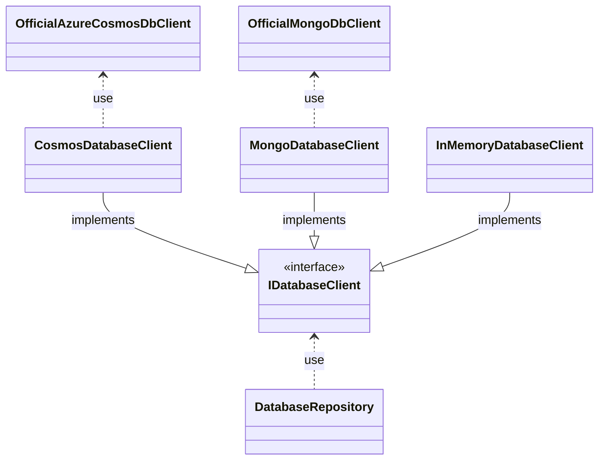

# Overview

Welcome to the Infrastructure Database Libs documentation

## Motivation

The goal of the `wemogy.Infrastructure.Database` library, is to define a unified way to abstract a database. The abstraction should be provider independent, which means that the actual implementation of the `IDatabaseClient` can change without changing the rest of the implementation. Using this approach allows us to declare our interfaces once, generate an actual implementation at runtime and run the same source code against several database providers (e.g. InMemory, Azure Cosmos DB, MongoDB).

Unit-testing database implementations should be automated, regardless of the database provider under test. The tests should be written in an abstract way and should be successful, regardless if a cosmos/mongo-db or in-memory database is being tested.

## Features

- Provider-independent repositories for **Azure Cosmos DB**, **MongoDB** and an **in-memory** implementation (see [Database Providers](./11-database-providers.md)).
- A rich [repository API](./03-database-repository.md): CRUD, querying, [sorting & pagination](./05-sorting-pagination.md).
- [Soft delete](./07-soft-delete.md) that hides deleted entities from all reads.
- [Read & property filters](./08-filters.md) for centralized, secure-by-default data access.
- [Optimistic concurrency](./09-optimistic-concurrency.md) via the `[ETag]` attribute, with automatic retries.
- [Multi-tenancy](./04-multi-tenancy.md) through transparent partition-key prefixing.
- Provider-independent [error handling](./10-error-handling.md).

New here? Start with [Installation](./01-installation.md) and [Getting Started](./02-getting-started.md).

## Architecture

