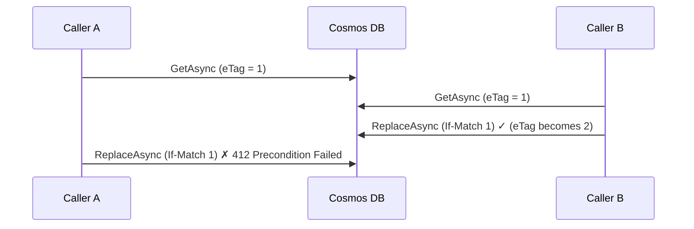

# Optimistic Concurrency (ETag)

Optimistic concurrency protects against the *lost update* problem: when two callers
read the same entity and both write it back, the second write would silently
overwrite the first. With an eTag guard the second write is rejected instead, so no
update is lost.

This feature is currently implemented for the **Azure Cosmos DB** provider.

## Opting in

Concurrency is opt-in per entity. Add a nullable `string` property marked with the
`[ETag]` attribute:

```csharp title="User.cs"
using Wemogy.Infrastructure.Database.Core.Abstractions;
using Wemogy.Infrastructure.Database.Core.Attributes;

public class User : EntityBase
{
    [PartitionKey]
    public string TenantId { get; set; } = string.Empty;

    public string Firstname { get; set; } = string.Empty;

    [ETag]
    public string? ETag { get; init; }
}
```

Entities without an `[ETag]` property are unaffected and continue to use
unconditional writes.

## How it works

The `[ETag]` property is bound to Cosmos' system `_etag` field through two
serialization rules that are applied automatically:

1. **Read:** the property is populated from the store's `_etag` on every read.
2. **Write:** the property is never serialized into the document body, so a stale
   value can never be persisted.

On `ReplaceAsync`, the eTag that the entity was read with is sent as an `If-Match`
condition. If the document changed in the meantime, Cosmos rejects the write with
HTTP 412 and the library throws a `PreconditionFailedErrorException`.



## Automatic retries

The `UpdateAsync` methods read the entity, apply your change and replace it. When a
concurrent write causes a `PreconditionFailedErrorException`, the operation is
retried automatically with an exponential backoff (3 retries) via a Polly retry
policy. Each retry re-reads the entity (getting the fresh eTag) and re-applies your
update action, so conflicting updates converge instead of being lost.

```csharp
// If another writer updates the user between the read and the write,
// this update is retried automatically against the fresh version.
var updated = await userRepository.UpdateAsync(
    user.Id,
    user.TenantId,
    u => u.Firstname = "Updated");
```

If the conflict persists beyond the retry limit, the
`PreconditionFailedErrorException` is surfaced to the caller.

:::caution Direct ReplaceAsync

A bare `ReplaceAsync` of a stale entity is *not* recoverable by retrying, because it
carries the same outdated eTag on every attempt. After the retries are exhausted it
throws `PreconditionFailedErrorException`. Prefer `UpdateAsync` for read-modify-write
flows, as it re-reads the entity on each attempt.

:::
